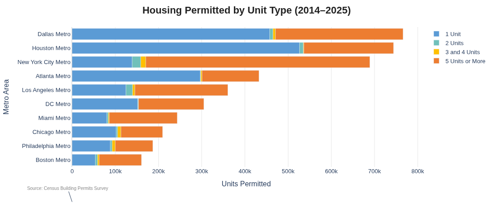

# Housing Permit Analysis: Top 10 U.S. Metros

Housing costs across the United States have been skyrocketing for the past few years, forcing millions of Americans to spend more of their income on housing. Part of the reason is because there is not enough housing where most Americans want to live. To investigate this crisis, I extracted building permit data and population data for the U.S.'s most populous metros from the Census Bureau and analyzed the data with Python's Pandas and Plotly libraries.

**Major findings:**
- Texas's two major metros built more housing than six other major metros combined
- L.A. has reached a record low for building
- The New York metro lost 760,000 people



Read the full analysis here: https://www.tajairi.com/Articles/Metro_Housing_Analysis.html

## How to Run

```bash
git clone <repo-url>
cd housing_examiner
uv sync
uv run jupyter notebook Major_Metros_housing_permitted.ipynb
```
